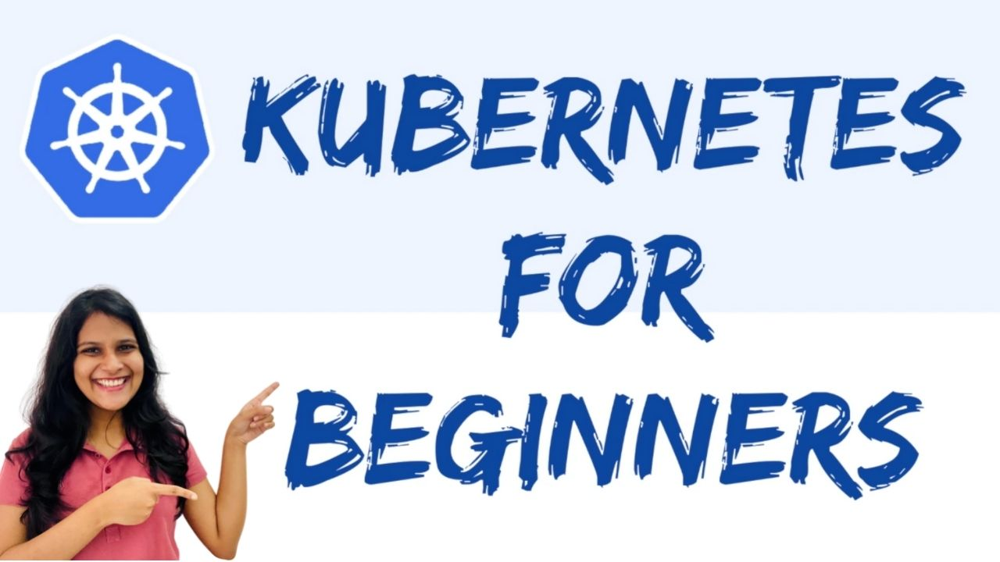

# Kubernetes-for-Beginners
Source code for my new animated tutorial 'Kubernetes for Beginners' on the Enlear Academy Youtube channel.

👇👇👇

https://youtu.be/1dOvIzFF55w

In this animated Kubernetes for beginners tutorial, you will learn the basics Kubernetes along with a demo at the end.
In this tutorial I will cover,
🔥 Why do we need Kubernetes with a real-world case study

🔥 What is Kubernetes

🔥 The basic architecture of Kubernetes

🔥 Basic Concepts  of Kubernetes 

🔥 Configurations of Kubernetes

🔥 Demo of deploying a react application

Don’t forget  to like and subscribe to our Youtube channel 👍

Docker Image : https://hub.docker.com/r/andreanimi/demo-react-app

